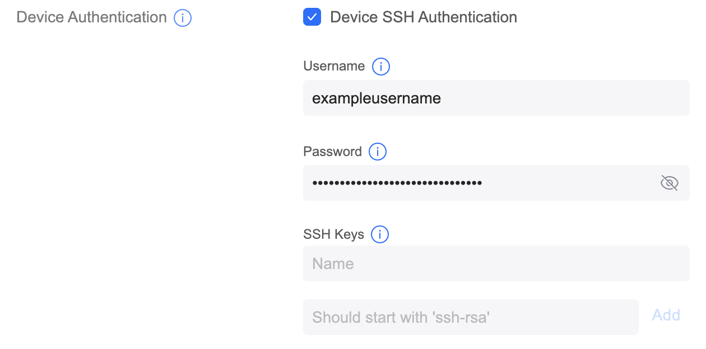
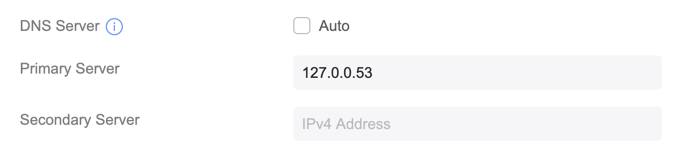

## Overview ##
This project is a collection of helper scripts for Ubiquiti UniFi hardware and software.  Currently it contains a single script.

## unifi-cloudflared-dns-over-https.sh
This script will provide an apt-managed install of cloudflared on Ubiquiti Gateway devices running UniFi OS, such as the UXG Lite.  It configures a DNS forwarder that listens on 127.0.0.53:53 that sends requests to a Cloudflare DNS over HTTPS endpoint.  If you use Cloudflare Gateway (part of Cloudflare Zero Trust), you can specify its DNS over HTTPS URL, otherwise it will use the URL associated with their 1.1.1.1 DNS service.

### Usage ###

1. Enable UniFi SSH Access
    In the UniFi Controller web interface, go to the page under _Settings &rarr; System &rarr; Advanced_ and scroll down to _Device Authentication_.  Device Authentication should be checked and authentication options configured to enable SSH access to your UniFi devices.

    

1. #### Copy script to gateway ####
    In this directory, copy the script to the UniFi device.  Substitute your SSH username and gateway IP in this command as needed.
    ```
    scp unifi-cloudflared-dns-over-https.sh exampleusername@192.168.0.1:/root/.
    ```

1. #### Running the script ####
    SSH to the gateway.  Substitute your SSH username and gateway IP in this command as needed.
    ```
    ssh exampleusername@192.168.0.1
    ```
    You should see a MOTD with an ASCII art UniFi logo.

    ***WARNING!***  **You are the root user once you log in.**  To quote [Ubiquiti's documentation:](https://help.ui.com/hc/en-us/articles/204909374-UniFi-Connect-with-SSH-Advanced)
    > Inexperienced users risk making changes that may degrade network performance, or even worse, completely break your deployment. Proceed with caution.

    [Optional] If you have a Cloudflare Gateway DNS over HTTPS URL, you can specify that now (xxxxxxxxxx will be a string of alphanumeric characters)
    ```
    export CLOUDFLARE_DNS_OVER_HTTPS_URL=https://xxxxxxxxxx.cloudflare-gateway.com/dns-query
    ```

    Mark the script executable:
    ```
    chmod +x unifi-cloudflared-dns-over-https.sh
    ```

    Now, run the script:
    ```
    ./unifi-cloudflared-dns-over-https.sh
    ```
    Output:
    ```
    Local UniFi OS is based on Debian Bullseye, continuing
    deb [signed-by=/usr/share/keyrings/cloudflare-main.gpg] https://pkg.cloudflare.com/cloudflared bullseye main

    Hit:1 https://security.debian.org/debian-security bullseye-security InRelease
    Hit:2 https://deb.debian.org/debian bullseye InRelease
    Hit:3 https://deb.debian.org/debian bullseye-updates InRelease
    Hit:4 https://deb.debian.org/debian bullseye-backports InRelease
    Hit:5 https://pkg.cloudflare.com/cloudflared bullseye InRelease
    Reading package lists... Done

    Reading package lists... Done
    Building dependency tree... Done
    Reading state information... Done
    The following NEW packages will be installed:
    cloudflared
    0 upgraded, 1 newly installed, 0 to remove and 40 not upgraded.
    Need to get 0 B/16.7 MB of archives.
    After this operation, 35.2 MB of additional disk space will be used.
    Selecting previously unselected package cloudflared.
    (Reading database ... 23977 files and directories currently installed.)
    Preparing to unpack .../cloudflared_2024.2.1_arm64.deb ...
    Unpacking cloudflared (2024.2.1) ...
    Setting up cloudflared (2024.2.1) ...
    Using https://xxxxxxxxxx.cloudflare-gateway.com/dns-query as DoH endpoint.

    Install of cloudflared successful! 🎉

    To finish configuration, do the following steps

    1. Reload systemctl to pick up the new unit file
        systemctl daemon-reload

    2. Start service now and run after system restart
        systemctl enable --now cloudflare-dns-proxy.service
    ```

    Assuming everything was successful, follow the instructions to enable and start the cloudflared service.

1. #### Post-Install Verification ####
    Check that the new service is running:
    ```
    systemctl status cloudflare-dns-proxy
    ```
    You should see a result similar to this:
    ```
    ● cloudflare-dns-proxy.service - cloudflared DNS proxy
     Loaded: loaded (/etc/systemd/system/cloudflare-dns-proxy.service; enabled; vendor preset: enabled)
     Active: active (running) since Thu 2024-02-22 22:13:31 EST; 12h ago
   Main PID: 681467 (cloudflared)
     Memory: 16.9M
        CPU: 51.403s
     CGroup: /system.slice/cloudflare-dns-proxy.service
             └─681467 /usr/local/bin/cloudflared proxy-dns --address 127.0.0.53 --upstream https://xxxxxxxxxx.cloudflare-gateway.com/dns-query

    Feb 22 22:13:31 UXG-Lite systemd[1]: Started cloudflared DNS proxy.
    Feb 22 22:13:31 UXG-Lite cloudflared[681467]: 2024-02-23T03:13:31Z INF Adding DNS upstream url=https://xxxxxxxxxx.cloudflare-gateway.com/dns-query
    Feb 22 22:13:31 UXG-Lite cloudflared[681467]: 2024-02-23T03:13:31Z INF Starting DNS over HTTPS proxy server address=dns://127.0.0.53:53
    Feb 22 22:13:31 UXG-Lite cloudflared[681467]: 2024-02-23T03:13:31Z INF Starting metrics server on 127.0.0.1:45440/metrics
    ```
    <br>
    At the prompt, run a `dig` using the new DNS forwarder:

    ```
    dig @127.0.0.53 ui.com
    ```

    The result should look something like this: 

    ```
    ; <<>> DiG 9.16.44-Debian <<>> @127.0.0.53 ui.com
    ; (1 server found)
    ;; global options: +cmd
    ;; Got answer:
    ;; ->>HEADER<<- opcode: QUERY, status: NOERROR, id: 3221
    ;; flags: qr rd ra; QUERY: 1, ANSWER: 4, AUTHORITY: 0, ADDITIONAL: 1

    ;; OPT PSEUDOSECTION:
    ; EDNS: version: 0, flags:; udp: 4096
    ; COOKIE: xxxxxxxxxxxxxxxx (echoed)
    ;; QUESTION SECTION:
    ;ui.com.				IN	A

    ;; ANSWER SECTION:
    ui.com.			41	IN	A	18.160.18.40
    ui.com.			41	IN	A	18.160.18.80
    ui.com.			41	IN	A	18.160.18.25
    ui.com.			41	IN	A	18.160.18.49

    ;; Query time: 20 msec
    ;; SERVER: 127.0.0.53#53(127.0.0.53)
    ;; WHEN: Fri Feb 23 10:15:52 EST 2024
    ;; MSG SIZE  rcvd: 135
    ```
    If you get any errors here, don't move on to the next section until you've addressed them.

1. #### Configuring WAN DNS Server
    Once the above is complete, you need to tell the gateway to use the forwarder rather than its default DNS server.  Go to _Settings &rarr; Internet_ and select your WAN.  It is named _Primary (WAN 1)_ by default, but may have a different name.  Enable Manual configuration and uncheck _Auto_ next to _DNS Server_.  Then put the forwarder's address of 127.0.0.53 in the text field next to _Primary Server_.  Click the _Apply Changes_ button and you're done.

    


1. #### Verifying DoH is working on your network
    Go to [Cloudflare's DNS test page](https://1.1.1.1/help) in a browser that is not using DNS over HTTPS.  (You may need to disable it in your browser - it's on by default in Firefox.)  If everything is working you will see _Yes_ next to _Using DNS over HTTPS (DoH)_.

1. #### [Optional] Locking down other DNS requests ####
    Some devices have hardcoded DNS server values that may be used for tracking or other purposes.  To prevent devices from using alternative DNS you'll need create firewall rules blocking to [as described here](https://ben.balter.com/2020/12/04/over-engineered-home-network-for-privacy-and-security/#blocking-all-other-dns-lookups) but the specifics are outside the scope of this README.

### TODO ###
- Add ability to have multiple DoH forwarders
- Add command line flags to handle only running part of the setup

### Acknowledgements ###
- Configuration and service management is inspired by [this post](https://eldridgea.substack.com/p/encrypted-cloudflare-dns-on-unifi)
- Repo install is based on the [instructions](https://pkg.cloudflare.com/index.html#debian-bullseye) on Cloudflare's website 
- Great post about UniFi network config [here](https://ben.balter.com/2020/12/04/over-engineered-home-network-for-privacy-and-security/#blocking-all-other-dns-lookups) and [its followup](https://ben.balter.com/2021/09/01/how-i-re-over-engineered-my-home-network/) that prompted me to look at this in the first place

## Contributing ##
* Please fork and submit PRs if you have any improvements.
* Please open an issue if you experience a problem
* Testing this on hardware or software not listed below would be great!

## Testing ## 
Has been tested on 
* Gateway Lite (UXG-Lite)
    * Firmware 3.1.16.12746
* Self-hosted UniFi Controller 
    * Version 8.0.28

## License ##
This work is licensed under the [Apache 2.0 license](http://www.apache.org/licenses/LICENSE-2.0). 

This is not a product of Ubiquiti Inc. or Cloudflare, Inc.  Their trademarks are used solely to describe the function of this software and do not imply endorsement by or affiliation with Ubiquiti Inc. or Cloudflare, Inc.